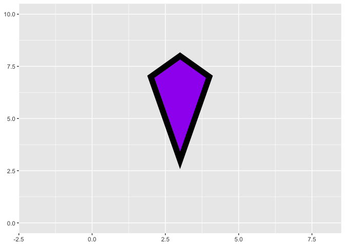
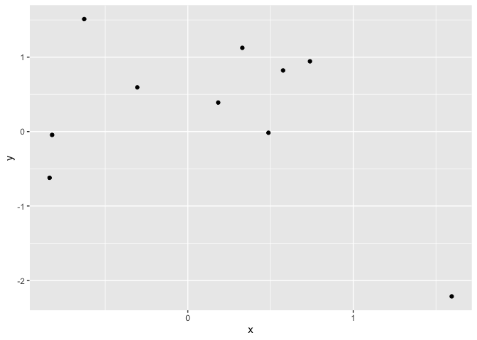
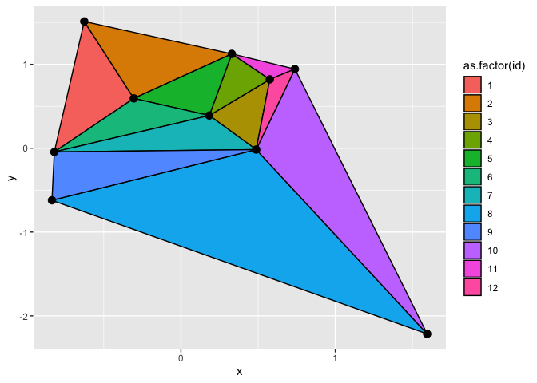

<!-- README.md is generated from README.Rmd. Please edit that file -->

# ggquadrilateral

<!-- badges: start -->

<!-- badges: end -->

`ggquadrilateral` provides a
[ggplot2](https://ggplot2.tidyverse.org/index.html) geom that can draw
arbitrary quadrilaterals in a convenient way.

## Installation

You can install the latest version of ggquadrilateral from
[GitHub](https://github.com/const-ae/ggquadrilateral) with:

``` r
devtools::install_github("const-ae/ggquadrilateral")
```

If you don’t already have devtools installed, you can get it from CRAN
with `install.packages("devtools")`.

## Example

First load `ggplot2` and the `ggquadrilateral` package

``` r
library(ggplot2)
library(ggquadrilateral)
```

The simplest example is to just define the positions of the four corners
manually

``` r
kite_df <- data.frame(
  left_tip_x = 2,
  left_tip_y = 7,
  top_tip_x = 3,
  top_tip_y = 8,
  right_tip_x = 4,
  right_tip_y = 7,
  bottom_tip_x = 3,
  bottom_tip_y = 3
)
kite_df
#>   left_tip_x left_tip_y top_tip_x top_tip_y right_tip_x right_tip_y
#> 1          2          7         3         8           4           7
#>   bottom_tip_x bottom_tip_y
#> 1            3            3
```

``` r
ggplot(kite_df) +
  geom_quadrilateral(aes(x1=left_tip_x, y1 = left_tip_y,
                         x2 = top_tip_x, y2 = top_tip_y,
                         x3 = right_tip_x, y3 = right_tip_y,
                         x4 = bottom_tip_x, y4 = bottom_tip_y),
                     color = "black", fill = "purple", size=4) +
  xlim(-2, 8) + ylim(0, 10)
```



It can also be used to visualize more complex data. We will now use it
to draw the triangle mesh for 10 random points.

``` r
df <- data.frame(x=rnorm(n=10, mean=0, sd=1),
                 y=rnorm(n=10, mean=0, sd=1))

ggplot(df, aes(x=x, y=y)) +
  geom_point()
```



We will use the
[`tripack`](https://cran.r-project.org/web/packages/tripack/index.html)
package to calculate the Delauney triangulation.

``` r
library(tripack)
triang <- as.data.frame(triangles(tri.mesh(df)))
triang_df <- data.frame(id = seq_len(nrow(triang)),
           p1x = df$x[triang$node1],
           p1y = df$y[triang$node1],
           p2x = df$x[triang$node2],
           p2y = df$y[triang$node2],
           p3x = df$x[triang$node3],
           p3y = df$y[triang$node3])
head(triang_df)
#>   id        p1x       p1y        p2x         p2y        p3x         p3y
#> 1  1 -0.6264538 1.5117812 -0.8204684 -0.04493361 -0.3053884  0.59390132
#> 2  2 -0.6264538 1.5117812 -0.3053884  0.59390132  0.3295078  1.12493092
#> 3  3  0.1836433 0.3898432  0.4874291 -0.01619026  0.5757814  0.82122120
#> 4  4  0.1836433 0.3898432  0.5757814  0.82122120  0.3295078  1.12493092
#> 5  5  0.1836433 0.3898432  0.3295078  1.12493092 -0.3053884  0.59390132
#> 6  6  0.1836433 0.3898432 -0.3053884  0.59390132 -0.8204684 -0.04493361
```

Using the `triang_df` that the coordinates for the 12 interpolating
triangles we can make the plot:

``` r
ggplot() +
  geom_quadrilateral(data=triang_df, 
                     mapping = aes(
                       x1 = p1x, y1 = p1y,
                       x2 = p2x, y2 = p2y,
                       x3 = p3x, y3 = p3y,
                       # We want triangles, so we make the
                       # fourth point identical to the third
                       x4 = p3x, y4 = p3y,
                       fill = as.factor(id)),
                     color = "black") +
  geom_point(data= df, aes(x=x, y=y), size = 3) 
```


